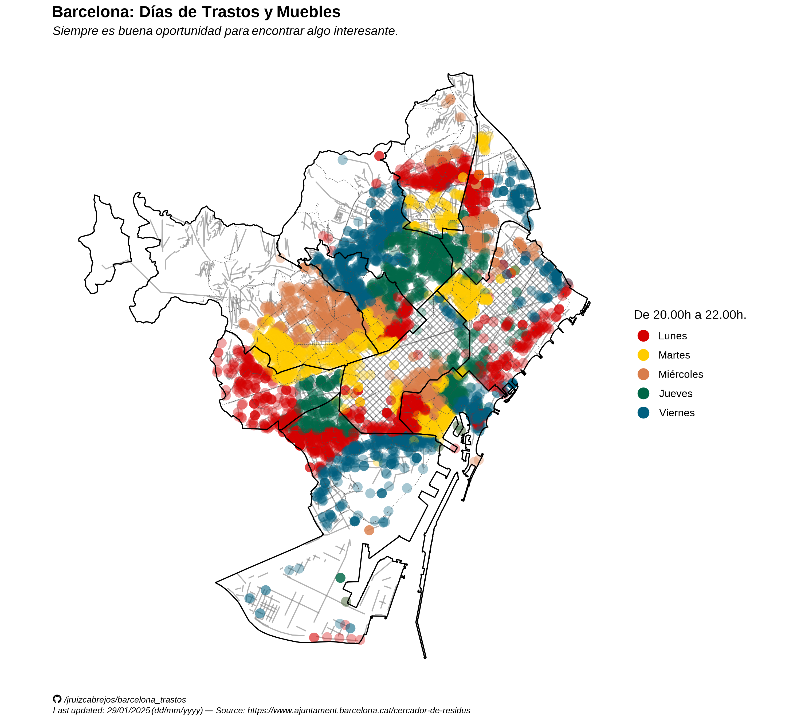
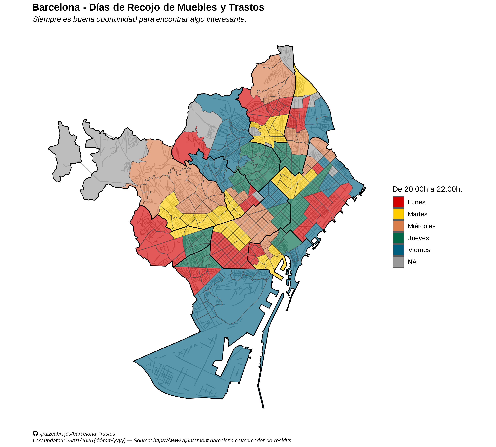

# Trastos and Furniture Map Collection Days for Barcelona, Spain 

It is always a good opportunity to find something interesting.

*Panel from the webcomic [Emmy the Robot](https://www.webtoons.com/en/canvas/emmy-the-robot/list?title_no=402201) by Dominic Cellini*

## Acknowledgment

Inspired on [Zara Patterson Google Map from 2010](https://www.google.com/maps/d/u/0/viewer?mid=1l2VAhplHwkWYhNi6WOcDeqnxPoE&ll=41.38994767203882%2C2.1714785646320367&z=13&fbclid=IwAR0Nz0oQug6qn9cU2yfmNpWFeOKMcscwQf2-Gp2Oiks0WavhvUgzlui5_FE) and her website https://caerengracia.wordpress.com/, in which she ["lists resources to carry on restoration and renovation works ecologically"](https://caerengracia.wordpress.com/eco-recursos/).

## Intro

"Where and when can I salvage old, abandoned, furniture in Barcelona?"

This is a question that my friends, friends of friends, coworkers and myself have asked from time to time (as unlikely as it may sound). 
Unfortunately, the only real map available online was last updated in 2016 (Originally made by Zara in 2010) . 

Since I couldn't find a **complete** map of Barcelona with the days for trash (furniture) collection, I have compiled the data from the Ajuntament website and made my own maps.

They are now yours. 

Happy hunting.

## Maps

The raw data can be found in this repository. I might document this, eventually. 

## Notes

It is a miracle by itself that Zara's map managed to survive for this long in a service hosted by Google, [unlike the faith of many other Google services that have been discontinued over time.](https://www.theverge.com/2019/11/26/20977968/google-graveyard-products-shut-down-dead-not-supported-discontinues-spring-cleaning/archives/3)

It is also true that there are _some_ resources out there, similar to what I have done here. However, they have several limitations:

- The town hall (Ajuntament/Municipality) of Barcelona only provides information on trash collection days [for each street individually.](https://ajuntament.barcelona.cat/cercador-de-residus/ca)

- The other alternative are maps for each district individually[(1)](https://ajuntament.barcelona.cat/horta-guinardo/es/noticia/muebles-y-trastos-viejos-el-dia-que-toca-3_1345274),[(2)](https://ajuntament.barcelona.cat/lescorts/es/noticia/mobles-i-trastos-vells-el-dia-que-toca-2_1346730),[(3)](https://ajuntament.barcelona.cat/gracia/ca/noticia/muebles-y-trastos-viejos-el-dia-que-toca-2_1345185). Some of these have different presentations [(4)](https://ajuntament.barcelona.cat/santmarti/ca/noticia/desfer-se-de-mobles-i-trastos-vells-el-dia-que-toca-1344869), making it hard to do any manual "stitching".

- Same for other individual maps made for individual districts (e.g. [GeoBioCat](https://geobiocat.blogspot.com/2017/04/mapa-dia-dels-mobles-leixample.html))
